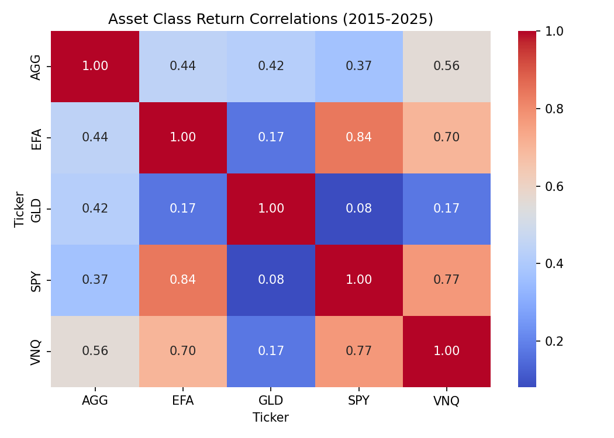
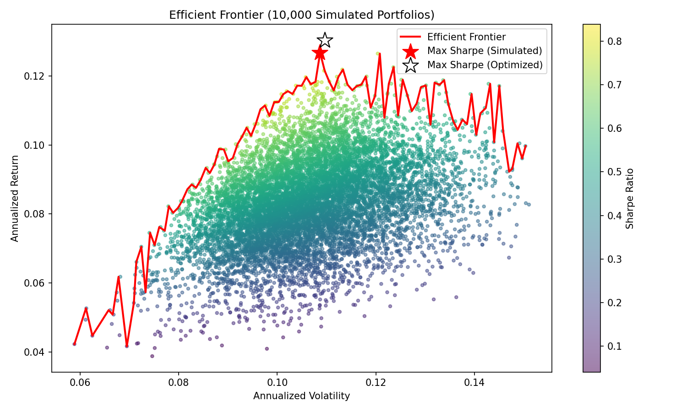

# Portfolio Optimization: Efficient Frontier & Maximum Sharpe Ratio

This project constructs an efficient frontier using Modern Portfolio Theory (MPT) and identifies the maximum Sharpe ratio portfolio across five asset class ETFs. Data is pulled directly from Yahoo Finance via `yfinance` and the optimization is solved both through Monte Carlo simulation and scipy's constrained optimizer.

---

## Data

Monthly closing prices were downloaded for five ETFs covering major asset classes:

| Ticker | Asset Class |
|---|---|
| SPY | U.S. Equities |
| AGG | U.S. Bonds |
| GLD | Gold / Commodities |
| VNQ | Real Estate (REITs) |
| EFA | International Equities |

**Period:** January 2015 – December 2025 | **Observations:** 131 monthly returns

---

## Libraries

```python
import yfinance as yf
import pandas as pd
import numpy as np
import matplotlib.pyplot as plt
import seaborn as sns
from scipy.optimize import minimize
```

---

## Results

### Asset Class Return Correlations (2015–2025)



Before optimizing, it is useful to examine how the five asset classes move together. A few notable findings from the correlation matrix:

- **SPY and EFA (0.84)** — international equities are strongly tied to U.S. markets, reflecting the increasing integration of global capital markets over the past decade. This limits the diversification benefit of adding international exposure.
- **SPY and VNQ (0.77)** — real estate is heavily influenced by broad market conditions, partly due to the growth of institutional REIT ownership.
- **GLD and SPY (0.08)** — gold has near-zero correlation with U.S. equities, making it the most genuinely diversifying asset in this set. Its hedging properties tend to strengthen during market stress, when diversification matters most.
- **AGG and SPY (0.37)** — the traditionally negative stock/bond correlation broke down over this sample period, driven largely by the 2022–2023 rate hike cycle which simultaneously hurt both equities and bonds.

---

### Efficient Frontier (10,000 Simulated Portfolios)



The efficient frontier was constructed by simulating 10,000 random portfolios, each with weights drawn randomly and normalized to sum to 1 (long-only, fully invested). Each portfolio is plotted by its annualized volatility and return, colored by Sharpe ratio. The upper edge of the point cloud — the red line — is the efficient frontier, representing the highest return achievable at each level of risk.

Two maximum Sharpe ratio portfolios are marked:
- **Red star** — best portfolio found across 10,000 simulations
- **White star** — mathematically precise optimum found via scipy's SLSQP optimizer

The two stars sit close together, confirming the simulation and optimizer converged on the same region of the frontier.

**Risk-free rate:** 3-month T-bill rate as of December 31, 2025 (3.57%). Under the historical average T-bill rate over the sample period (~1.98%), Sharpe ratios would be higher given the lower hurdle rate.

---

### Maximum Sharpe Ratio Portfolio

| Metric | Simulated | Optimized |
|---|---|---|
| **Return** | 12.68% | 13.05% |
| **Volatility** | 10.86% | 10.96% |
| **Sharpe Ratio** | 0.8388 | 0.8647 |

**Optimized weights:**

| Ticker | Weight |
|---|---|
| SPY | 0.00% |
| AGG | 0.00% |
| GLD | 45.86% |
| VNQ | 54.14% |
| EFA | 0.00% |

The optimizer allocated entirely to GLD and VNQ, with zero weight in SPY, AGG, and EFA. This is a textbook example of the **concentration problem** in mean-variance optimization. With no constraints beyond weights summing to 1 and no short selling, the optimizer takes historical returns at face value and finds concentrated allocations that look attractive in-sample but are unlikely to hold out of sample.

The GLD/VNQ concentration is driven by GLD's combination of strong historical returns (11.73% annualized) and near-zero correlation with other assets — a profile that was heavily influenced by the post-COVID inflation surge driving gold prices significantly higher. A different sample period would likely produce meaningfully different weights.

In practice, analysts address this by imposing **diversification constraints** — for example, requiring each asset to hold at least a 5–10% allocation — to force more realistic portfolios. This would be a natural extension of this analysis.

---

## Summary

Over the 2015–2025 period, a two-asset portfolio of gold (GLD) and U.S. real estate (VNQ) produced the highest risk-adjusted return among the five asset classes examined, with an optimized Sharpe ratio of 0.865. SPY delivered the highest raw return (14.17% annualized) but its high volatility and strong correlations with other assets made it unattractive to the mean-variance optimizer. The near-zero correlation of GLD with all other assets was the primary driver of the result, underscoring gold's role as a diversifier in multi-asset portfolios. The concentration of the optimal solution highlights a known limitation of unconstrained mean-variance optimization and motivates the use of diversification constraints in practical portfolio construction.
